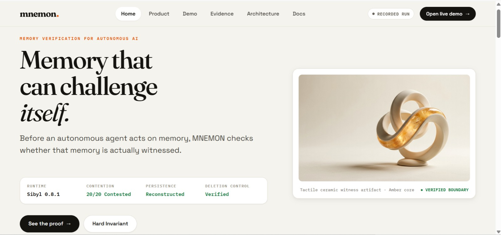
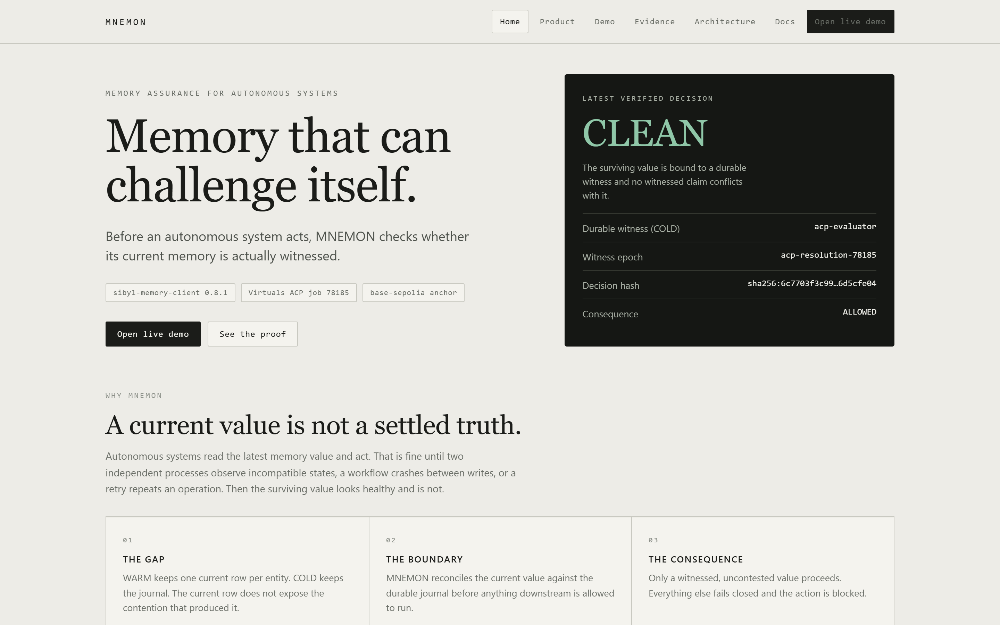
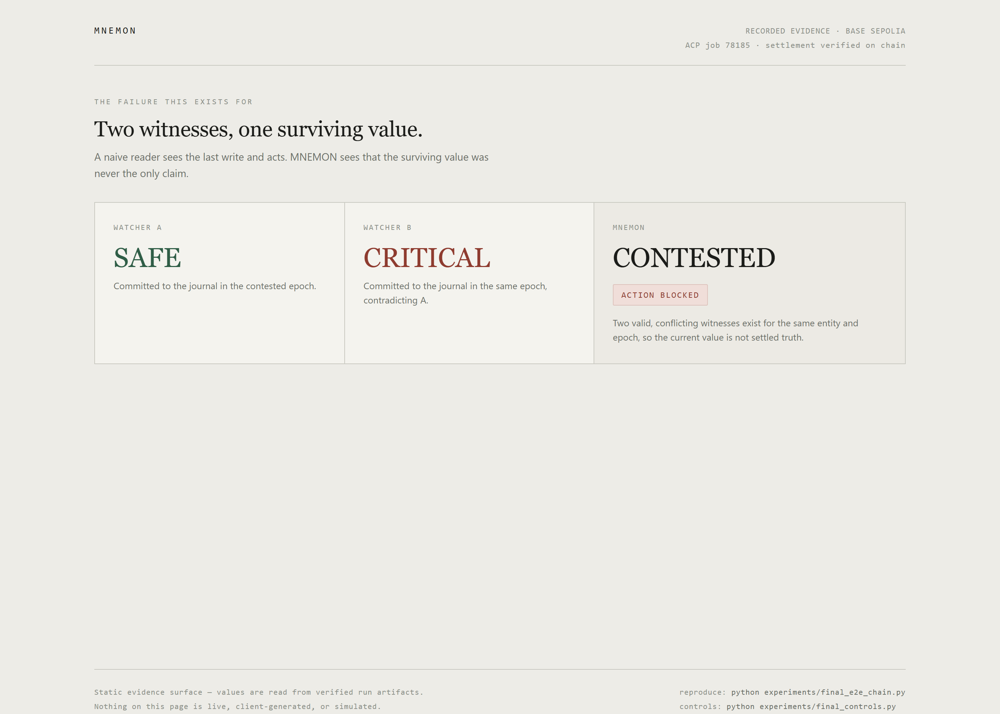
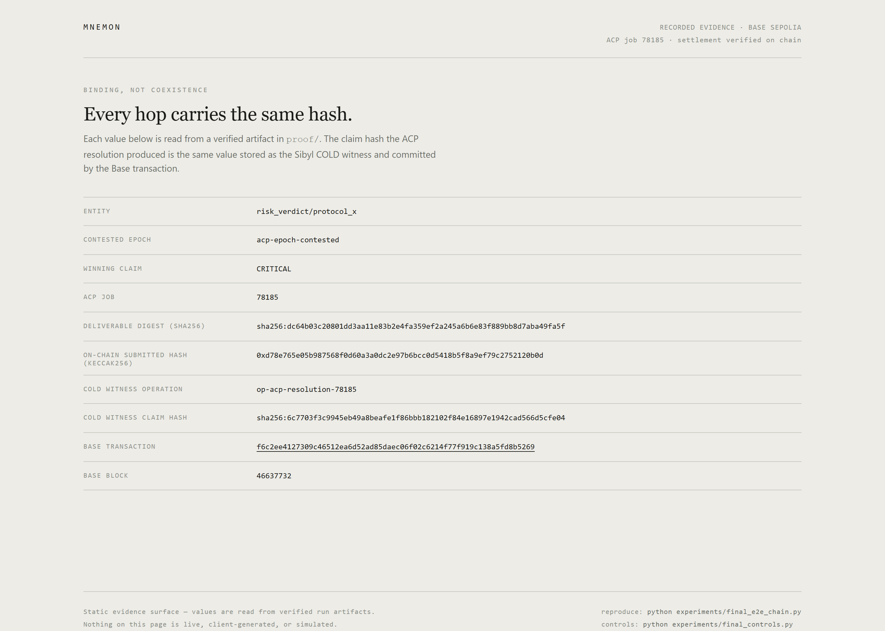
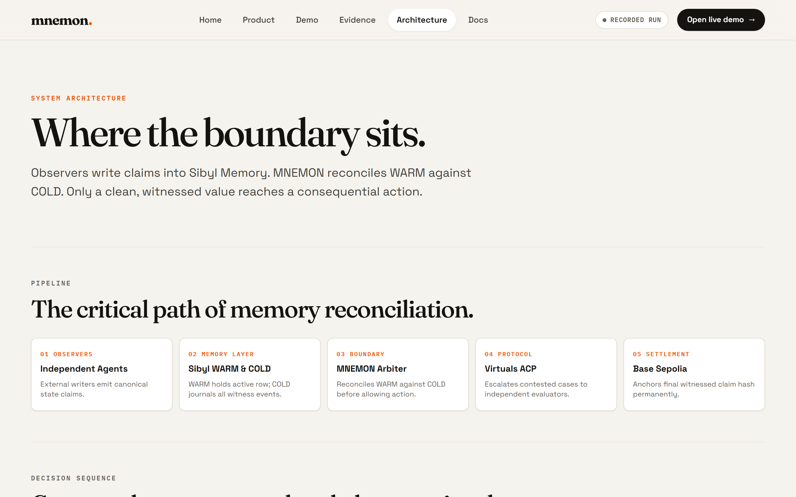
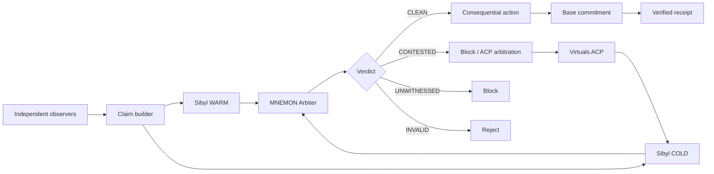
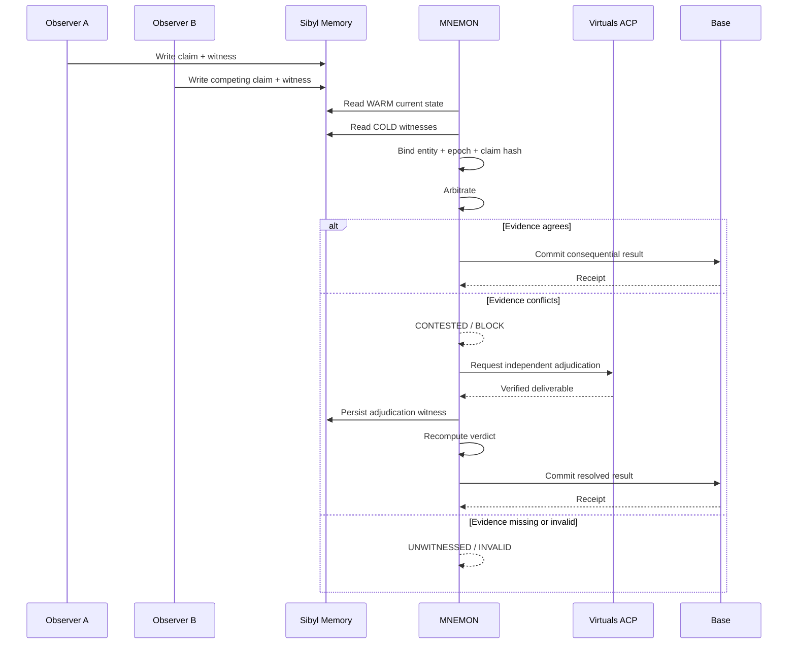

# MNEMON

> **Before an autonomous system acts, MNEMON checks whether its current memory is actually witnessed.**




MNEMON is a memory-consistency boundary for autonomous systems. It reconciles Sibyl Memory's current WARM state with durable COLD evidence and refuses to authorize a consequential action when the current state is contested, unwitnessed, or invalid.

## Product links

| Surface | Link |
|---|---|
| Product surface | [mnemon-ochre.vercel.app](https://mnemon-ochre.vercel.app) |
| Interactive demo | [mnemon-ochre.vercel.app/demo](https://mnemon-ochre.vercel.app/demo) |
| Evidence page | [mnemon-ochre.vercel.app/evidence](https://mnemon-ochre.vercel.app/evidence) |
| Architecture | [mnemon-ochre.vercel.app/architecture](https://mnemon-ochre.vercel.app/architecture) |
| GitHub | [github.com/0xkinno/mnemon](https://github.com/0xkinno/mnemon) |
| Demo video | Not published yet |
| Base contract | [Base Sepolia contract](https://sepolia.basescan.org/address/0x4e6042c9E85c64CbACA27Da9da1B1B862565a13f) |
| Base transaction | [Verified CLEAN receipt](https://sepolia.basescan.org/tx/0x293e4e55ad6bce6fa99a14e5fcb25851bd4c34df3b67073f7fd722d21076996e) |
| Base ACP-resolution anchor | [Verified receipt binding job `78185`](https://sepolia.basescan.org/tx/f6c2ee4127309c46512ea6d52ad85daec06f02c6214f77f919c138a5fd8b5269) |
| Virtuals ACP | Job `78185` completed — [`proof/acp_job_78185.json`](proof/acp_job_78185.json) |
| Evidence | [`proof/`](proof/) |
| Discovery | [`DISCOVERY.md`](DISCOVERY.md) |
| Deployment | [`DEPLOYMENT.md`](DEPLOYMENT.md) |

## The problem

Autonomous systems often consume the latest memory value as if it were settled truth.

That becomes dangerous when independent processes have observed incompatible states, when a workflow crashes between writes, when a retry repeats an operation, or when the current value cannot be tied back to durable evidence.

A naive consumer asks:

```text
What is the value now?
```

MNEMON asks:

```text
What is the value now — and can I prove why I am allowed to act on it?
```

## The solution

MNEMON creates a **witness boundary** between fast current state and durable evidence.

```text
                 CURRENT STATE
                      │
                    WARM
                      │
                      ▼
               ┌──────────────┐
               │    MNEMON    │
               │    ARBITER   │
               └──────┬───────┘
                      │
                reconcile with
                      │
                      ▼
                COLD witnesses
                      │
          ┌───────────┼───────────┐
          ▼           ▼           ▼
      matching     conflict    missing /
      witness      witness      invalid proof
          │           │           │
          ▼           ▼           ▼
        CLEAN      CONTESTED   UNWITNESSED
          │                       │
          │                       └── BLOCK
          ▼
   consequential action
```

## Hard invariant

> **A consequential decision may be marked CLEAN only when the current WARM claim is bound to a valid durable COLD witness for the same entity and epoch, and no unresolved conflicting witnessed claim exists.**

Everything else fails closed.

## The four verdicts

| Verdict | Meaning | Consequence |
|---|---|---|
| **CLEAN** | Current WARM state has a valid matching witness and no unresolved conflict | Action may proceed |
| **CONTESTED** | Independent witnessed claims disagree for the same entity and epoch | Action blocked or escalated |
| **UNWITNESSED** | Current state cannot be tied to the required durable witness | Action blocked |
| **INVALID** | Claim, hash, entity, epoch, or evidence binding is inconsistent | Action blocked |

## Why Sibyl Memory is load-bearing

MNEMON does not use Sibyl as a notepad or cache.

The decision boundary depends on persistent memory to reconstruct both the current state and the evidence needed to justify that state.

The decisive control is deletion:

```text
Sibyl Memory available
        ↓
WARM + COLD evidence
        ↓
MNEMON can establish CLEAN / CONTESTED / ...

Delete the memory layer
        ↓
required witness disappears
        ↓
MNEMON cannot establish CLEAN
        ↓
ACTION = BLOCKED
```

A fresh process can reconstruct the result from persisted memory without Python globals, browser state, or session context.

## What we discovered

The verified primitive is a separation between **current WARM state** and **durable COLD history**.

In the real `sibyl-memory-client==0.8.1` runtime, WARM state has uniqueness semantics for the current entity record while COLD events are written through a separate transaction. Two independent processes can therefore produce competing claims without receiving a conflict exception; the final WARM row alone does not expose the complete contention history.

MNEMON turns that hidden gap into an explicit safety boundary.

The discovery and runtime verification are documented in [`DISCOVERY.md`](DISCOVERY.md) and `proof/source_verification.json`.

## Verified experiment

### Real Sibyl runtime

- `sibyl-memory-client==0.8.1`
- real `MemoryClient(Storage(...))`
- no compatibility shim on the critical path
- two independent OS processes
- 20 race trials
- 0 writer exceptions
- 20/20 reconstructed as `CONTESTED`

### Counterfactual benchmark

The benchmark compares a WARM-only reader with MNEMON's reconciliation path:

| Reader | False-clean result |
|---|---:|
| WARM-only baseline | **10 / 10** |
| MNEMON | **0 / 10** |

These are results from the repository's controlled benchmark corpus, not claims about every workload.

### Final close-out evidence

The submission state was re-derived end to end from the live Sibyl database and the live Base Sepolia receipt, not from stored notes:

| Artifact | What it proves |
|---|---|
| [`proof/final_e2e_chain.json`](proof/final_e2e_chain.json) | The exact claim hash produced by the ACP resolution is the value held as the Sibyl COLD witness **and** the value committed by the Base transaction (`linkage_verified: true`, 19/19 link checks) |
| [`proof/final_deletion_control.json`](proof/final_deletion_control.json) | With the ACP artifact and the Base anchor both present on disk, deleting the entity or losing the memory layer still yields `UNWITNESSED` and `BLOCKED` |
| [`proof/final_fresh_session.json`](proof/final_fresh_session.json) | A brand-new interpreter with no cache, globals, or fixture injection reconstructs the resolved `CLEAN` state from persistence alone |
| [`proof/final_integrity_audit.json`](proof/final_integrity_audit.json) | 17 unsafe conditions end in `BLOCK` or a safe reclassification; none silently become `CLEAN` |
| [`proof/base_acp_resolution.json`](proof/base_acp_resolution.json) | The Base Sepolia anchor that binds the ACP result: transaction `0xf6c2ee41…`, block `46637732` |

## Explore in 2 minutes

### 1. Trigger the race

```bash
python experiments/real_sibyl_race.py
```

Two independent processes write competing observations for the same logical entity.

### 2. Observe the contradiction

The naive current-state read can return a single value. MNEMON reconstructs the durable contention and returns:

```text
CONTESTED
ACTION = BLOCKED
```

### 3. Kill the process / start fresh

The fresh-session proof rebuilds the verdict from persisted Sibyl Memory.

### 4. Run the proof suite

```bash
python -m pytest -q
```

### 5. Delete memory

Repeat the decision with the memory layer unavailable.

Expected:

```text
UNWITNESSED
ACTION = BLOCKED
```

## Product surface

The deployed app is a real client-side application with six routes. Every route is reachable from the navbar and every link resolves.

| Route | What it shows |
|---|---|
| `/` | The thesis, the memory contradiction, the four verdicts, how it works, live proof, and the demo CTA |
| `/product` | What MNEMON is, who it is for, and the deliverable contract |
| `/demo` | The interactive instrument: OBSERVE, RECONCILE, VERDICT, ACTION |
| `/evidence` | The evidence panel, the proof index with content hashes, and the ACP / Base identifiers |
| `/architecture` | Where the boundary sits and the failure modes it refuses to hide |
| `/docs` | The document index and the exact reproduction commands |

### Two modes, one engine

`/demo` runs in one of two modes and says on screen which one is active:

- **live engine** - when `python scripts/demo_api.py` is running. The page calls the instrument API, which drives the real `mnemon` arbiter over a real `sibyl-memory-client` database. Every verdict on screen was produced by that call, and a control stays disabled until the underlying call returns.
- **recorded run** - when the instrument is not reachable. The page replays a recorded verified run whose every value is read from `proof/`.

Nothing is preloaded in either mode: a step appears only after its control is used, and a control is enabled only after the previous step completed. There is no mock backend and no second engine. Runtime values come from the engine, from `proof/`, or not at all.

### Run the instrument locally

```bash
python scripts/demo_api.py        # serves app/ and the instrument API on :8080
# open http://127.0.0.1:8080/demo
```

## Product screenshots

<table>
  <tr>
    <td align="center" width="50%"></td>
    <td align="center" width="50%"></td>
  </tr>
  <tr>
    <td align="center" width="50%"></td>
    <td align="center" width="50%"></td>
  </tr>
</table>

All four frames are the same landscape `1440×900` frame captured at 2× (2880×1800), one per route, from the routed surface in [`app/`](app/). They are identical in size by construction: `node scripts/shots.mjs` never captures beyond the viewport, so no frame can come out oversized or portrait.

## Architecture



## Product flow



## Failure engineering

MNEMON is designed around falsification.

| Attack | Expected result |
|---|---|
| Concurrent writers | `CONTESTED` |
| Crash during workflow | No unsafe `CLEAN` |
| Retry | Idempotent handling |
| Duplicate witness | Safe duplicate handling |
| Wrong entity | `INVALID` |
| Wrong epoch | `INVALID` |
| Tampered claim | `INVALID` |
| Missing witness | `UNWITNESSED` |
| Deleted memory | `UNWITNESSED` + blocked |
| Fresh process | State reconstructed from persistence |
| Replayed ACP result | Safe rejection / duplicate recognition |

The goal is not to make failure impossible. The goal is to make **unsafe confidence impossible to hide**.

## Virtuals ACP integration

MNEMON uses ACP only for a genuinely unresolved `CONTESTED` case.

The verified job path is:

```text
CONTESTED
    ↓
Virtuals ACP job 78185
    ↓
Provider deliverable
    ↓
Independent hash binding verification
    ↓
Sibyl COLD witness
    ↓
MNEMON recomputation
    ↓
CLEAN
```

Job `78185` completed the full ACP lifecycle and released the 0.01 USDC provider budget. The repository also preserves the earlier rejected job as a documented operational failure experiment; the successful job is the submission evidence.

ACP is therefore part of the product's decision path, not a partner badge.

## Base integration

A resolved MNEMON decision is anchored through a real Base contract interaction.

Current verified deployment:

| Item | Value |
|---|---|
| Network | Base Sepolia |
| Contract | [`0x4e6042c9E85c64CbACA27Da9da1B1B862565a13f`](https://sepolia.basescan.org/address/0x4e6042c9E85c64CbACA27Da9da1B1B862565a13f) |
| Verified transaction | [`0x293e4e55ad6bce6fa99a14e5fcb25851bd4c34df3b67073f7fd722d21076996e`](https://sepolia.basescan.org/tx/0x293e4e55ad6bce6fa99a14e5fcb25851bd4c34df3b67073f7fd722d21076996e) — block `46585270` |
| ACP-resolution anchor | [`0xf6c2ee4127309c46512ea6d52ad85daec06f02c6214f77f919c138a5fd8b5269`](https://sepolia.basescan.org/tx/f6c2ee4127309c46512ea6d52ad85daec06f02c6214f77f919c138a5fd8b5269) — block `46637732` |

There are two Base Sepolia anchors in `proof/`, and they are not interchangeable. The earlier transaction proves the contract path works end to end (`epoch-clean`). The **ACP-resolution anchor** is the one that binds this submission: its decoded event carries the same claim hash, epoch, and operation id that the ACP resolution produced and that Sibyl COLD holds as the witness.

The transactions and decoded events are retained as machine-checkable evidence. Only the exact network and evidence actually exercised by the build are claimed.

## Memory implementation

MNEMON uses two complementary classes of persistent state:

| Tier | Purpose |
|---|---|
| **WARM** | Current value used for fast decision-making |
| **COLD** | Durable witness history used to detect contention and reconstruct decisions |

A claim is canonically represented with identifiers such as:

```text
operation_id
entity_key
epoch_id
watcher_id
claim_hash
evidence_refs
```

The hash binds the verdict to the exact canonical payload rather than an opaque label.

## Setup

```bash
python -m venv .venv
source .venv/bin/activate
python -m pip install -r requirements.txt
python -m pytest -q
```

Windows PowerShell:

```powershell
.venv\Scripts\Activate.ps1
python -m pip install -r requirements.txt
python -m pytest -q
```

## Configuration and secrets

Commit:

```text
.env.example
```

Keep local credentials in:

```text
.env
.env.local
```

Never commit private keys, Privy authorization keys, RPC secrets, or API keys.

Never expose them through `NEXT_PUBLIC_*` variables.

## Repository structure

```text
mnemon/
  memory.py       # Sibyl integration
  claims.py       # canonical claim construction
  receipt.py      # proof records
  arbiter.py      # four-state arbitration

experiments/
  real_sibyl_race.py
  final_e2e_chain.py     # re-derives the ACP -> COLD -> verdict -> Base linkage
  final_controls.py      # deletion, fresh-session, and integrity audits
  final_base_link.py     # minimum Base commitment that binds the ACP result
  app_evidence.py        # injects verified values into the static surface

scripts/
  acp_arbitrate.ts
  acp_inspect.ts
  acp_preflight.mjs
  acp_provider_submit.mjs
  build_check.mjs        # npm run build -- the production gate
  demo_api.py            # local instrument API over the real engine
  responsive.mjs         # structural verification across viewports
  shots.mjs              # regenerates the README assets
  base_anchor.py
  verify_base.py
  serve_app.py           # plain static preview of app/

app/
  index.html      # static shell: navbar, main, footer, evidence snapshot
  app.css         # the surface stylesheet
  app.js          # client-side router, six views, demo instrument
  evidence.json   # the same snapshot, for the instrument API
  product.html demo.html evidence.html architecture.html docs.html
                  # per-route entry files, byte-identical to index.html
  banner.html

docs/
  ACP_SETUP.md

assets/
  banner.png
  screenshot-01.png ... screenshot-04.png

proof/
  race_matrix.json
  race_output.json
  fresh_session.json
  delete_memory.json
  replay.json
  tamper.json
  source_verification.json
  run_manifest.json
  acp_job_78185.json
  acp_cold_result.json
  acp_fresh_process.json
  final_e2e_chain.json
  final_deletion_control.json
  final_fresh_session.json
  final_integrity_audit.json
  base_acp_resolution.json

DISCOVERY.md
EVIDENCE.md
PROOF.md
DEPLOYMENT.md
vercel.json
README.md
```

## Reproducibility

Every final experiment should record:

```text
runtime version
source verification
commit identifier
run timestamp
experiment command
input corpus
result
```

Proof artifacts are first-class outputs, not screenshots added after the fact.

The final close-out is reproducible from a clean checkout. The first two commands re-read the live database and the Base Sepolia receipt, so they need network access:

```bash
python experiments/final_e2e_chain.py     # ACP -> COLD -> verdict -> Base linkage
python experiments/final_controls.py      # deletion, fresh-session, integrity audits
python experiments/app_evidence.py        # refresh the static evidence snapshot
npm run build                             # production build gate
node scripts/responsive.mjs               # 6 viewports x 6 routes, structural checks
node scripts/shots.mjs                    # regenerate the README assets
```

`npm run build` fails if the rendered snapshot has drifted from `proof/` in any way, if a route in the navbar has no view, if a link points at an unknown route, if a referenced asset is missing, if an executable inline script reappears, if a secret or a raw key-shaped value leaks into client-visible output, if the local database path is exposed to the browser, or if the page reaches for server-side code.

`node scripts/responsive.mjs` drives the bundled headless Chromium across `390x844`, `430x932`, `768x1024`, `1024x1366`, `1440x900` and `1920x1080`, and across all six routes. It fails on horizontal overflow, on anything wider than the viewport, on a control pushed outside it, on text below 12px, on an unlabelled control, and on a view that did not render. It then opens the mobile menu, clicks every navbar link, and runs the first demo control to prove the instrument moves and gates in order. Set `MNEMON_BASE_URL` (for example `https://mnemon-ochre.vercel.app`) to run the same checks against the deployment, where the router uses the History API instead of hash mode.

## Prior Work declaration

MNEMON is an original project developed for the Sibyl Labs Memory Hackathon.

The implementation uses open-source SDKs and standard cryptographic primitives where appropriate. The MNEMON witness-boundary mechanism, arbitration states, failure experiments, proof artifacts, and application layer are project-specific work.

Third-party dependencies remain under their respective licenses and are documented by the repository's package manifests.

## Hackathon alignment

The official Sibyl Labs Memory Hackathon rubric is:

| Criterion | Weight | MNEMON evidence |
|---|---:|---|
| Memory is load-bearing | 40% | WARM/COLD critical path, fresh-session recall, deletion failure |
| Innovation & originality | 25% | Witness boundary between current state and durable evidence |
| Technical execution | 20% | Real race reproduction, four-state arbiter, tamper/replay tests, real ACP, real Base transaction |
| Pitch & presentation | 15% | One failure mode, one invariant, one proof-driven story |

A verified Base action and exercised Virtuals ACP path are represented only because they are real and inspectable.

## Status

### Verified

- Real `sibyl-memory-client==0.8.1`
- 20 two-process contention experiments
- 20/20 `CONTESTED`
- Fresh-process reconstruction
- Memory deletion failure path
- Tamper detection
- Replay/idempotency coverage
- Real Virtuals ACP job `78185`
- ACP deliverable hash binding
- ACP result persisted to Sibyl COLD
- Fresh-process reconstruction after ACP resolution
- Real Base Sepolia deployment and transaction
- Base transaction that binds the ACP result (block `46637732`)
- ACP result -> Sibyl COLD -> final decision -> Base linkage verified (19/19 link checks)
- Deletion control with ACP and Base artifacts present but non-substituting
- 17/17 integrity-audit cases end in `BLOCK` or safe reclassification
- Production build gate passes (`npm run build`)
- All four README frames regenerated from the app at one uniform size
- Static surface deployed to Vercel production ([mnemon-ochre.vercel.app](https://mnemon-ochre.vercel.app))
- No mock, simulated, or placeholder claim remains on the critical path


## License

MIT
